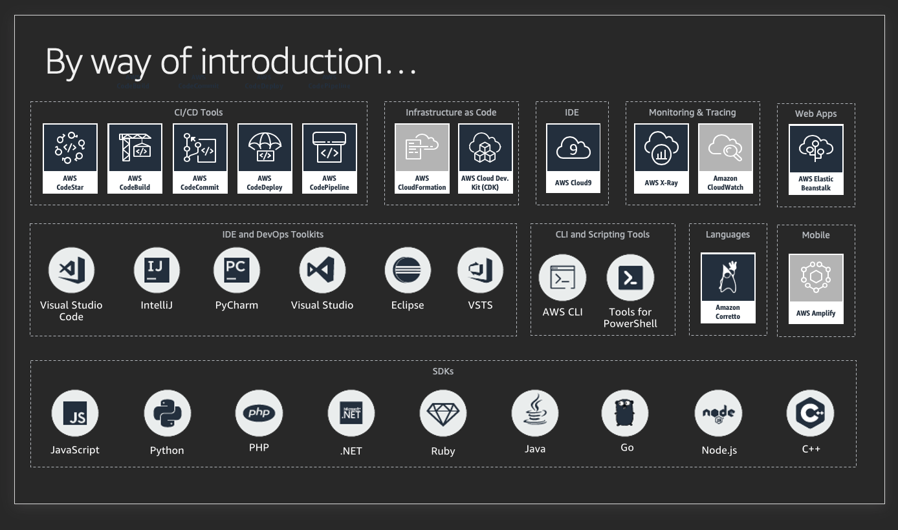
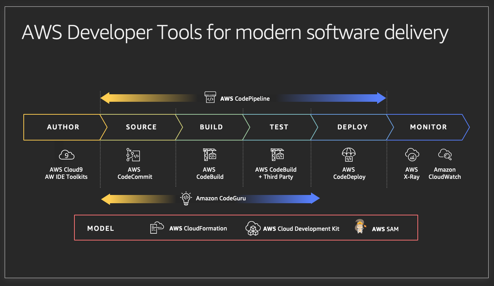

## Simple ECS Fargate and CodePipeline Demo

This repo is a simple plotly demo that leverages Fargate and Codepipeline to host a dashboard and implement dashboard changes through a CI/CD pipeline.

## Overview of Developer Tooling and Software Delivery at Amazon

## Welcome to your CDK TypeScript project!

The `cdk.json` file tells the CDK Toolkit how to execute your app.

## Useful commands

 * `npm run build`   compile typescript to js
 * `npm run watch`   watch for changes and compile
 * `npm run test`    perform the jest unit tests
 * `cdk deploy`      deploy this stack to your default AWS account/region
 * `cdk diff`        compare deployed stack with current state
 * `cdk synth`       emits the synthesized CloudFormation template

 ## Make File and Order Explanation

 In order to initialize a pipeline, you must:

- Have a repostitory to store assets -> `make stage`
- Prime the pipeline by pushing current code and images to the repo -> `make prime`
  - Notice, you will have to edit the file based on the syntethized values coming from `make stage`
- Deploy the initial service and attach the pipeline `make deploy`
- Push code to the CodeCommit Repo to start the pipeline

The pipeline and service are under a couple assumptions:

- You are deploying to us-east-1
- You are creating a HTTP web service

## Resources

These where just some resources I used to help build this or that could help enhance this.

- https://docs.aws.amazon.com/codebuild/latest/userguide/build-spec-ref.html
- https://docs.aws.amazon.com/codepipeline/latest/userguide/file-reference.html#pipelines-create-image-definitions
- https://opensource.com/article/18/8/what-how-makefile
- https://github.com/aws-samples/aws-reinvent-2019-trivia-game
- https://aws.amazon.com/blogs/developer/testing-infrastructure-with-the-aws-cloud-development-kit-cdk/
